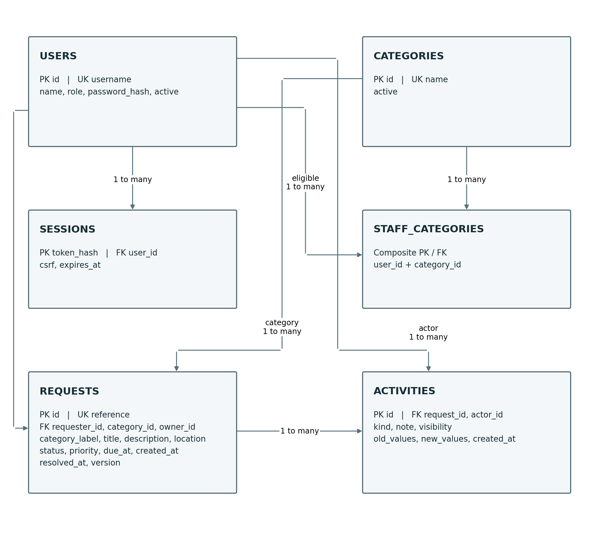

# CivicConnect Milestone 2 Person 2

This contribution defines the data model, persistence controls, technology choices and API contracts needed to support CivicConnect. It includes a working backend and database implementation, with initial automated evidence linked to the supplied M1 requirements. The selected direction is a relational SQLite store with a Node.js API for a small, single-host pilot.

| Document control | Value |
|---|---|
| Prepared for | Edward Goosen 602882 |
| Contribution | Person 2 as defined in Milestone 2 Detailed Work Division |
| Version and date | 1.0 contribution candidate, 16 September 2026 |
| Integration target | The existing team Project Engineering Document v2.0 |
| Source status | The supplied M1 Person 2 document is marked Draft, pending team review |
| Review and approval | Pending the team; no sign-off or GitHub approvals claimed |
| Implementation status | Backend/database candidate implemented; 24 automated tests passed |

The complete approved M1 PED and actual Assignment 2 research were not supplied. Existing requirement IDs and wording are retained. Decisions below are explicit candidate decisions for team review, not evidence that an earlier approved stack or baseline has been changed. Merge this contribution into the same team PED and retain its version history.

## 1 Scope and responsibility

The work division assigns Person 2 the data/persistence model, schema and integrity, persistence ADRs, technology comparison, API/integration decisions, initial database/backend implementation and the corresponding RTM evidence. Person 1 owns architecture and deployment direction. Person 3 owns UI and the two design-pattern decisions. This contribution supplies the data and interface information they need without replacing their decisions.

Basis: Master Brief sections 3, 9 to 18; M2 brief sections 4, 5.4, 5.5, 5.7, 5.8, 7 to 10 and 12; the Person 2 work-division section; and the supplied M1 Person 2 requirements.

## 2 Review of the M1 requirements

The baseline input contains FR-001 to FR-013 and NFR-001 to NFR-008. Their identifiers, source wording and acceptance criteria are preserved in the accompanying RTM. The work-division example calls submission FR-001, but the actual supplied requirements identify submission as FR-002 and authentication as FR-001. This contribution follows the actual requirement IDs.

| Item | Finding and treatment |
|---|---|
| Due dates | R3/FR-009 allow dates after creation, while AC-F09 requires future dates. CR-P2-001 proposes strictly future dates at assignment/rescheduling. Existing deadlines may naturally become overdue. |
| Undated requests | Candidate reporting counts open requests with no due time. Confirm this interpretation of R4. |
| Audit immutability | Append-only interfaces and SQL triggers protect normal operations. A privileged database administrator can still modify files/schema. Absolute tamper resistance is not claimed. |
| Oversight permissions | Read-only oversight is implemented. Accounts have one role; staff elevation is not implemented. |
| Concurrent creation | Unique references prevent duplicate identifiers and versions prevent lost updates. Repeated submissions are not semantically deduplicated; confirm whether idempotency keys are required. |
| Quality targets | 5,000 records, 20 users, response-time, alert and recovery targets remain unchanged but unverified. They were proposed in the supplied M1 draft. |

## 3 Data and persistence model

CivicConnect has structured relationships between requesters, service categories, staff responsibility and activity history. The request is the aggregate root for workflow changes: changing its state and recording the corresponding activity must be a single committed operation. Authentication sessions have a separate lifecycle.

| Entity | Key fields and ownership |
|---|---|
| User | id PK; unique username; name; password_hash; role; active. Identity provisioning owns these records. Roles are Requester, Staff and Oversight. |
| Category | id PK; unique name; active flag. The controlled service catalogue owns category definitions. Retire referenced categories instead of deleting them. |
| StaffCategory | Composite primary key (user_id, category_id), both foreign keys. Defines which staff can handle which categories. |
| ServiceRequest | id PK; unique reference; requester_id/category_id/owner_id FKs; category_label snapshot; title, description, location; status, priority; due_at, created_at, resolved_at; version. |
| Activity | id PK; request_id/actor_id FKs; kind, note, visibility; old_values/new_values; created_at. Holds receipt, assignment, status, scheduling and work-note history. |
| Session | token_hash PK; user_id FK; csrf; expires_at. Raw session token stays in the cookie, while the database retains its hash. |

A separate Status entity is not necessary for the fixed current lifecycle: a database CHECK constraint and a domain transition map control allowed values. A separate Assignment table is also unnecessary for the candidate: the current owner belongs to ServiceRequest, and earlier owners are retained in Activity snapshots. Separate tables can be introduced if approved requirements later add assignment periods, multiple owners or configurable statuses.

### 3 1 Entity relationship diagram

Arrows run from referenced parent to dependent records. Each request has one requester, one category and zero or one current staff owner. Each activity has one request and one actor. The Mermaid and SVG sources are included for editing. Table names in the SQL are users, categories, staff_categories, requests, activities and sessions.

### 3 2 Required fields and lifecycle

The server requires a title of 1 to 120 characters, description of 1 to 4,000 and an active category. Location is optional and limited to 200 characters. The creation operation assigns a unique reference and UTC time, while database defaults set Normal priority and Received status. The title and description limits are implementation constraints for review, rather than previously approved M1 limits.

Assignment requires an eligible owner, priority and due time. The lifecycle is Received to Assigned to In progress to Resolved to Closed, or Received to Rejected. Rejections need reasons and resolutions need summaries. Reopening is excluded by the supplied R2. Terminal requests cannot be reassigned or rescheduled in the candidate; notes may still be appended. This interpretation needs team confirmation.

### 3 3 Relationships access and retention

Foreign keys prevent orphaned requests, activities and eligibility mappings. A category-label snapshot preserves the original label after retirement or renaming. User deactivation prevents subsequent authenticated access without deleting history. Requesters see their own requests and public activities; staff see authorized categories; oversight can read organisational records and reports. No mutation API permits editing or deleting an activity.

Descriptions, locations and notes may contain sensitive information. Use synthetic test data now. Protect database and backup access, minimize collected data, and agree retention and archival rules before real deployment. Full before/after request snapshots improve accountability but increase storage and retention cost. An approved retention policy must address that trade-off.

## 4 Data integrity and consistency

| Business risk | Implemented control | Initial evidence |
|---|---|---|
| Invalid enum values | CHECK constraints for role, status, priority, visibility and active flags | Migration 001 and policy checks |
| Illegal status sequence | Transition map enforced in RequestService; database also requires owner/due fields for assigned and later states | T07 and T08 |
| Unauthorized owner | Service checks active Staff role and category eligibility before assignment | T06 |
| Silent overwrite | Client supplies expected version; UPDATE uses id and version; successful update increments version | T10 returns conflict on stale input |
| Half-complete update | BEGIN IMMEDIATE; request update and activity insert commit together or both roll back | T11 injects an audit failure |
| Orphan or duplicate ID | Foreign keys, composite keys and unique request reference | Migration 001; creation tests |
| History mutation | No edit/delete endpoints plus UPDATE/DELETE-blocking activity triggers | T12 |
| Lost persistence | Committed data saved in SQLite; consistent backup API provided | T17 close/reopen and T18 snapshot readback |

SQLite serializes writers, and WAL allows readers to continue while a writer appends changes [S03]. This does not solve stale form submissions by itself. The version check detects the case where a staff member read an older record before another update committed. A 409 response asks the client to refresh and review current values. The server does not automatically replay the stale write.

The transaction is synchronous and contains no external network call. Repository.transaction starts the transaction, runs the operation, then commits or rolls back. Audit insertion failure aborts the operation. Database constraints and service validation serve different purposes: constraints protect stored structure; the service enforces actor-specific eligibility, lifecycle and business validation.

### 4 1 Reporting correctness

Open means Received, Assigned or In progress. Overdue means open and due_at earlier than now. Undated means open with no due_at. Resolved, Closed and Rejected are separate state counts. MTTR is creation to first resolution, averaged across currently Resolved or Closed requests. A closed request contributes once, using its original resolved_at. A category with no qualifying resolutions has no MTTR value, not zero.

Creation-date filters use UTC start midnight inclusive and the next day after the end date exclusive. This includes the entire selected end date. The future UI must label those UTC boundaries and may display individual timestamps in local time. T15 verifies the arithmetic; T16 rejects invalid or reversed date ranges.

## 5 Persistence decision record

| ADR field | Record |
|---|---|
| Identifier | ADR-P2-001 Relational SQLite persistence |
| Status | Implemented candidate; team approval pending |
| Drivers | FR-002, FR-003, FR-008, FR-012, FR-013, NFR-003 and NFR-008 |
| Decision | Use relational SQLite on local persistent disk with foreign keys, explicit transactions, version checks and append-only activity records. |
| Alternatives | JSON files, document database, and a separately managed relational server such as PostgreSQL. |
| Evidence | Structured source requirements; official SQLite/Node documentation S02 to S05; tests T03, T10 to T12, T17 and T18. |
| Revisit trigger | Measured write contention, multi-host scaling, unsupported storage, or an approved team platform decision incompatible with local SQLite. |

A relational model fits required joins, ownership and transaction boundaries. JSON files would transfer locking, referential integrity and recovery work into custom code. A document store can represent requests but does not remove the need to preserve relationships and atomic history. A server database is a credible option if hosting or concurrency requires it; it adds a service, credentials, networking and operational setup to M2.

The candidate chooses SQLite for low setup burden and a single-host pilot, not as a claim that it is universally superior. The application and database are a single point of failure. Backups improve recoverability but do not supply high availability. SQLite usage guidance supports local embedded use when workload and deployment fit [S04]. Lists/reports currently filter permission-scoped rows in memory, so the 5,000-record performance target is unproven. Move filtering, aggregation and pagination into SQL before drawing scale conclusions.

The Node SQLite binding is release-candidate API stability in the researched 24.x documentation [S02]. Isolate it behind the repository, pin the tested runtime and retest upgrades. A move to another database still requires schema, query, migration, backup and regression changes. The actual A2 persistence finding must be linked when supplied; no section or conclusion is invented here.

## 6 Technology comparison and selection

This is a qualitative evidence matrix. Numeric weights and scores are deliberately omitted because all three members have not supplied capability, effort or hosting evidence. The local runtime experiment supports one candidate, but does not prove that it is the team’s best option. Record the final team choice in ADR-P2-002 after checking any existing technology commitment.

| Criterion | Node core and SQLite | Express and PostgreSQL | ASP NET Core and relational DB |
|---|---|---|---|
| Requirement fit | Structured records and transactions demonstrated locally | Credible web/relational option; not built in this package | Credible web/relational option; not built here |
| Team capability and learning | JavaScript/SQL familiarity must be demonstrated by all three members | Framework and DB operations learning must be checked | C#/.NET and data framework familiarity must be checked |
| Schedule and tooling | Single Node install; no third-party runtime dependency restore | Additional packages and separate DB setup | SDK/framework setup and selected DB setup |
| Security | Custom HTTP/session code increases review responsibility | Middleware ecosystem helps, but configuration/dependencies need review [S15] | Framework security facilities need selected-version review |
| Maintenance and dependency risk | Small explicit codebase; SQLite binding release-candidate risk [S02] | More package and DB-version compatibility to manage | Framework/ORM/runtime compatibility to manage |
| Cost and licensing | No paid package dependency; Node and SQLite notices checked [S13-S14] | Exact package versions/licences and hosting quote still needed | Exact runtime/packages/licences and hosting quote still needed |
| Deployment and scaling | Durable local disk, one instance; multi-host growth needs redesign | Separate DB service and network; deployment proof still needed | Compatible .NET host and DB; deployment proof still needed |

### 6 1 Selected candidate stack

| Concern | Selection and evidence |
|---|---|
| Frontend coordination | Propose HTML/CSS/browser JavaScript as a small same-origin client; Person 3 decides and implements the UI. No UI is included in this Person 2 package. |
| Backend | Node.js 24.x with core HTTP, crypto and SQLite APIs. Tested on 24.19.0. Node LTS selection follows S01. |
| Database | SQLite 3.53.3 reported by the tested runtime, accessed through node:sqlite. No separate database server. |
| Dependencies and build | npm scripts and package-lock.json; zero third-party runtime dependencies. No compilation step required. |
| Testing | Node built-in test runner; temporary SQLite databases; HTTP tests. 24 checks passed in the final Person 2 backend. |
| Deployment coordination | Single persistent host behind HTTPS proxy proposed for Person 1 review. Loopback development exercised; BC machine and hosting compatibility unverified. |
| Versions and upgrades | The official page listed a newer 24.x patch than the test runtime. Qualify a current supported patch before staging. 24.19.0 is a reproducibility record, not a latest-version claim. |

ADR-P2-002 selects this stack for the candidate because a working local integration path was feasible with few installation dependencies. The cost is responsibility for custom HTTP/session handling and a synchronous data-access path. Before expanding authentication scope, compare a maintained web/identity framework. A zero-package count is not a security guarantee.

Node distribution licensing includes MIT and third-party notices; SQLite core has a public-domain dedication [S13-S14]. Hosting, persistent storage, backups, monitoring and support still have costs. No provider price, free-tier entitlement or institutional compatibility is assumed. Person 1 and Person 2 should obtain actual platform evidence before committing.

## 7 API and integration design

ADR-P2-003 chooses a same-origin JSON API for the intended UI. The API is a real implemented boundary in this backend package. It does not introduce separate microservices: the HTTP handlers, application operations and repository execute within one process. The frontend integration remains Person 3 work. Origin and CSRF requirements are part of that handoff.

| Method and path | Responsibility and principal data |
|---|---|
| POST /api/login | Authenticate username/password; return user and csrf; set HttpOnly session cookie. |
| GET /api/me and POST /api/logout | Read current identity/token; invalidate session and expire cookie. |
| GET /api/categories and /api/staff | Return active categories or eligible staff within caller category scope. |
| POST /api/requests | Requester submits title, description, category_id and optional location. Return 201 with persisted request/reference. |
| GET /api/requests | Role-scoped list; q, status, category, owner, priority, from, to, sort and direction filters. |
| GET /api/requests/{id} | Authorized details and permitted activities; hide other requesters’ records and internal notes. |
| POST /api/requests/{id}/assign | version, owner_id, priority, due_at and note; assign or reassign open request. |
| POST /api/requests/{id}/schedule | version, priority, due_at and note; change open request schedule. |
| POST /api/requests/{id}/status | version, status and note; enforce transition and mandatory reasons/summaries. |
| POST /api/requests/{id}/note | version, note and explicit Public or Internal visibility. |
| GET /api/reports | Oversight-only category metrics, ownership and MTTR; optional UTC creation-date range. |
| GET /health | Minimal process/database check; not an alerting system. |

### 7 1 Validation security and failure behaviour

Inputs are validated at the server even if a future UI validates first. IDs/version must be positive integers. Enumerations and string lengths are checked. JSON bodies are limited to 16 KiB. Mutation requests require an exact Origin match. Authenticated mutations also require the session-bound X-CSRF-Token. Permission checks run for direct resource access, not only the list screen. These choices follow authorization and CSRF guidance [S08-S09].

Passwords use random salts and scrypt with N=131072, r=8, p=1, following S10. Sessions use cryptographically random tokens, hashed storage and an eight-hour expiry. Login errors do not distinguish unknown users from incorrect passwords. Logout invalidates the server record. Staging requires HTTPS and Secure cookies; local testing uses synthetic data over loopback HTTP.

| HTTP status | Meaning and client action |
|---|---|
| 400 | Correct invalid input; database state remains unchanged. |
| 401 | Sign in before accessing protected data. |
| 403 | Operation, Origin or CSRF check rejected. |
| 404 | Resource unavailable or outside caller scope; do not reveal ownership. |
| 409 | Record changed; refresh and review before resubmitting. |
| 413 | Reduce body size. |
| 415 | Send application/json. |
| 429 | Login attempt limit reached; wait and retry. |
| 500 | Generic internal error with correlation ID; investigate sanitized server log. |
| 503 | Database busy when identified; retry after a delay. |

Internal audit snapshots are removed from requester responses. SQL user values are parameterized. Unexpected errors do not return SQL details or sensitive payloads. The in-memory login throttle resets on restart and is not a distributed abuse-control system. Proxy configuration, TLS, password recovery and broader security assessment remain open.

### 7 2 Contract evolution and external systems

The current /api contract has no external-client compatibility promise. Breaking changes must update code, API documentation, tests, RTM and decisions together. A separate /api/v1 boundary is deferred until independent clients make version compatibility necessary. In-app feedback is stored as activity and retrieved on refresh under R3. No SMS, email, broker or external notification integration is included. If later approved, define retry/failure and transaction consistency before adding external delivery.

## 8 Initial implementation and verification

| File or folder | Person 2 evidence |
|---|---|
| db/migrations/001_initial.sql | Schema, foreign keys, unique/check constraints, indexes and append-only triggers. |
| src/infrastructure/database.js | Initial schema migration with user_version=1; foreign keys, WAL, FULL synchronous mode and busy timeout. |
| src/infrastructure/request-repository.js | Scoped queries, eligibility, optimistic update, transaction coordination and activity persistence. |
| src/application/request-service.js | Backend integration operations, authorization, assignments, lifecycle and report calculations. Coordinate component-design decisions with Person 3. |
| src/domain/policy.js | Validation, supported statuses and transition rules. |
| src/http/app.js and auth.js | JSON endpoints, sessions, CSRF and credentials boundary. |
| scripts/setup.js and backup.js | Idempotent synthetic accounts/categories and consistent SQLite backup. |
| tests/civicconnect.test.js | 24 executable domain, persistence and HTTP checks. |
| docs/quality/test-results.tap | Actual final Person 2 automated test output. |

To run: install Node 24.19.0 or a compatible later 24.x patch, open the backend folder, run npm ci --ignore-scripts, npm run setup, npm test, then npm start. Setup prints random local demo passwords once; save them privately. Visit /health or use an API client. There is no homepage or UI in this package. Detailed authenticated API steps are in README.md.

All 24 automated tests passed. The tests show selected behaviours, not full acceptance of every requirement. T17 closes/reopens a database; it is not a forced-crash or power-loss test. T10 supplies stale versions; it is not a sustained multi-process load test. T18 restores a small snapshot; it does not prove the 60-minute RTO or 24-hour RPO. Browser, usability, WCAG, production TLS, monitoring and load targets remain unverified.

## 9 Person 2 traceability contribution

The workbook preserves all 21 original requirements and shows Person 2 data impact, decisions, technology, code and verification. It marks architecture/ASR allocation as Person 1 input and UI/design allocation as Person 3 input where appropriate. Team approval remains separate from implementation status. No GitHub issue, branch, commit, PR, approval or release reference is invented.

| Trace step | FR-008 assignment evidence |
|---|---|
| Requirement | FR-008: assign a Received request or reassign an active request to an eligible owner; require priority and due time. |
| Quality driver | Data integrity and least privilege from NFR-003/NFR-001; formal ASR identifier to be assigned by Person 1. |
| Architecture responsibility | Backend request operation and persistence boundary; final module allocation to be reconciled with Person 1. |
| Data | requests.owner_id, status, priority, due_at, version; staff_categories eligibility; activities history. |
| Decisions | ADR-P2-001 transactions/version control; ADR-P2-002 Node/SQLite; ADR-P2-003 assignment API; CR-P2-001 future due time. |
| Implementation | RequestService.mutate, RequestRepository.update/activity/transaction, POST /api/requests/{id}/assign. |
| Initial checks | T06 eligible owner/deadline, T10 stale conflict, T11 rollback, T20 prior owner retained. |
| Shared continuation | Person 3 connects the actual UI/design decision; team adds genuine issue/PR/review links and approval. |

## 10 Risks dependencies and recovery

The following are Person 2 additions for the shared Risk Register. Ratings are proposed planning judgements on a 1 to 5 scale, not measured probabilities. Exposure is probability multiplied by impact. Owners are proposed responsibilities until the team assigns a named member.

| ID and exposure | Risk | Mitigation and contingency |
|---|---|---|
| P2-R01; 3 × 4 = 12 | Single host/disk failure interrupts all requests | Consistent off-host backups and recovery drill; restore on replacement host |
| P2-R02; 3 × 4 = 12 | Synchronous reads/one writer miss latency target | SQL filtering/pagination; load test; server DB if measured contention persists |
| P2-R03; 3 × 5 = 15 | Backup cannot meet recovery/data-age targets | Daily protected off-host copy, integrity check and timed restore |
| P2-R04; 2 × 4 = 8 | Runtime patch or binding change breaks persistence | Pin, review release notes and rerun suite; retain compatible prior release |
| P2-R05; 3 × 5 = 15 | Custom HTTP/session code has security gaps | Peer review and negative tests; HTTPS/abuse controls; framework identity review |
| P2-R06; 4 × 4 = 16 | Candidate differs from actual team stack/baseline | Reconcile approved PED, CR and real A2 evidence before merge |
| P2-R07; 3 × 4 = 12 | Host/BC environment lacks runtime or durable disk | Run compatibility proof and obtain actual hosting quote before commitment |
| P2-R08; 3 × 4 = 12 | Audit copies retain sensitive data and grow rapidly | Approve retention/access policy; measure growth and archive under control |

Person 2 owns database, API and dependency mitigation proposals; backup/hosting/network items are shared with Person 1. All risks remain open. Dependencies include Node 24.x on the actual team machines, a writable durable local filesystem, a confirmed HTTPS proxy direction and the real A2 persistence/integration findings.

Recovery direction: use the supplied backup API for a consistent snapshot, schedule protected off-host copies, restore to a clean path while writes are stopped, verify integrity and known records, invalidate restored sessions, then run API smoke checks before reopening access. Do not copy only the live main SQLite file while ignoring WAL. Scheduling, off-host storage and a timed staging drill are still required [S05].

GET /health can be polled by an external monitor. It does not itself meet the 60-second outage-alert target, and it cannot notify anyone when the process is dead. Person 1 coordinates the hosting/monitoring direction; Person 2 supplies database health and failure information.

## 11 Decision control and team handoff

| Record | Decision status and team action |
|---|---|
| ADR-P2-001 | Relational SQLite persistence: implemented candidate; compare with approved team database decision and A2 findings. |
| ADR-P2-002 | Technology stack: tested candidate; confirm capability, current runtime patch, platform and licence/dependency choices. |
| ADR-P2-003 | Same-origin API: implemented backend; Person 3 integrates client handling, CSRF and version conflicts. |
| CR-P2-001 | Future due-date rule: proposed clarification; approve or adjust code/tests consistently. |
| PED/RTM | Merge this contribution and RTM columns into the existing controlled records; preserve M1 history and requirement IDs. |
| GitHub | Author real issues/changes and PRs; obtain two independent teammate approvals; record actual links. |
| A2 evidence | Attach exact relevant findings, alternatives, document version and section/page. No unseen research claim is treated as complete. |
| Baseline approval | Pending. Person 2 supplies evidence; the three-member team approves the shared M2 baseline. |

This contribution does not select the team’s two design patterns or UI layout. Its repository and service code provide a concrete integration example for Person 3 to review. If their approved design changes the boundaries, update the code, interfaces, tests and traceability through the team’s change process.

## 12 AI use and verification

Material AI assistance produced this contribution, the candidate backend, documentation and tests. The assistant checked primary sources and ran the automated suite. Student/team verification, modifications and approvals remain to be recorded after they happen. The accompanying AI Usage Register entry describes that assistance accurately. Every student must understand and be able to explain or modify any included code.

## 13 Person 2 defence notes

### Why a relational model

Requests have stable relationships, eligible owners and history that must stay consistent. Foreign keys and transactions address those concrete needs.

### Why SQLite rather than PostgreSQL

The candidate supports a small single-host pilot with simple setup. PostgreSQL remains credible if hosting or measured concurrency needs justify a separate server. The team has not yet approved the candidate choice.

### What prevents a half-saved assignment

The request update and audit insert share one transaction. T11 deliberately fails audit insertion and verifies rollback.

### What happens when two staff members edit

The expected version must match the stored version. The second stale change gets 409 and must refresh.

### How is API security enforced

Session identity, server-side role/category/owner checks, exact Origin and CSRF token checks protect the boundary. Hiding UI controls is insufficient.

### What can you honestly claim has passed

The 24 named automated checks in the provided run output. Not full security, performance, accessibility, disaster recovery or stakeholder acceptance.

### What remains for your teammates

Person 1 confirms architecture/deployment and formal ASRs. Person 3 integrates UI/design decisions. All three review the PED, RTM, source evidence and baseline.

## 14 References

[S01] Node.js. Node.js releases. https://nodejs.org/en/about/previous-releases (Accessed 16 September 2026).

[S02] Node.js. Node.js 24 SQLite API. https://nodejs.org/docs/latest-v24.x/api/sqlite.html (Accessed 16 September 2026).

[S03] SQLite. Isolation in SQLite. https://www.sqlite.org/isolation.html (Accessed 16 September 2026).

[S04] SQLite. Appropriate uses for SQLite. https://www.sqlite.org/whentouse.html (Accessed 16 September 2026).

[S05] SQLite. SQLite backup API. https://www.sqlite.org/backup.html (Accessed 16 September 2026).

[S08] OWASP. Authorization Cheat Sheet. https://cheatsheetseries.owasp.org/cheatsheets/Authorization_Cheat_Sheet.html (Accessed 16 September 2026).

[S09] OWASP. CSRF Prevention Cheat Sheet. https://cheatsheetseries.owasp.org/cheatsheets/Cross-Site_Request_Forgery_Prevention_Cheat_Sheet.html (Accessed 16 September 2026).

[S10] OWASP. Password Storage Cheat Sheet. https://cheatsheetseries.owasp.org/cheatsheets/Password_Storage_Cheat_Sheet.html (Accessed 16 September 2026).

[S13] Node.js contributors. Node.js LICENSE. https://github.com/nodejs/node/blob/main/LICENSE (Accessed 16 September 2026).

[S14] SQLite. SQLite copyright. https://www.sqlite.org/copyright.html (Accessed 16 September 2026).

[S15] Express. Production best practices security. https://expressjs.com/en/advanced/best-practice-security/ (Accessed 16 September 2026).

Internal sources: SEN381 Master Project Brief v1.1; SEN381 CivicConnect Milestone 2; CivicConnect Milestone 1 Person 2 Deliverables, 9 September 2026, draft; CivicConnect Milestone 2 Detailed Work Division. The actual approved combined PED and A2 submission were unavailable.