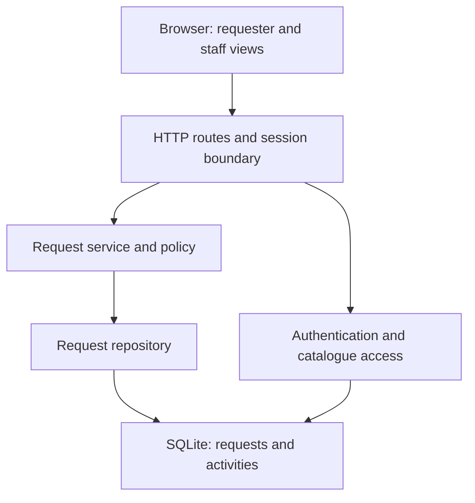
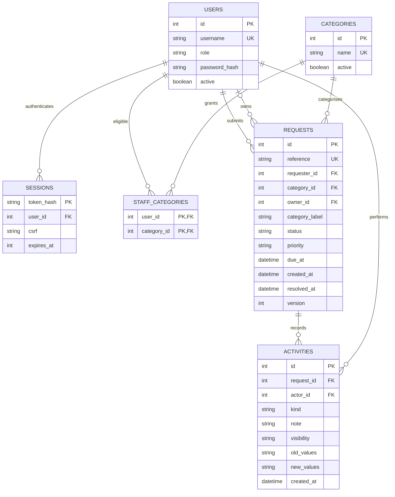
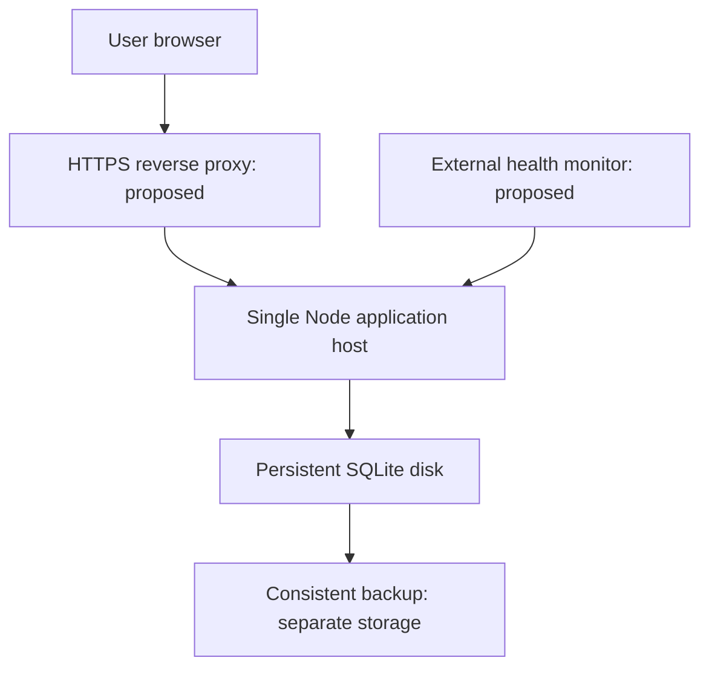

# Project Engineering Document (PED v2.0)
**Project:** CivicConnect
**Team:** Albert Du Plooy - 601969, Amelia van der Walt - 601649, Edward Goosen - 602882

## Document Control
| Version | Date | Changes | Author(s) |
| :--- | :--- | :--- | :--- |
| 1.0 | 2026-09-09 | Initial baseline formulation for Milestone 1 | Albert, Amelia, Edward |
| 2.0 | 2026-09-30 | Architecture, technology and initial design; consolidated team traceability, construction evidence and integration actions | Shared team contributions; consolidation for Edward |

---

**M2 document status:** Completed consolidated engineering document for peer review. Formal M2 baseline approval is pending; this is not a claim that all requirements have passed acceptance testing.

**Repository snapshot:** `main` commit `1afade59adb1bf1ae57fc4d88b1032ee4dc65e0f`, inspected on 30 September 2026. Intended repository location: `docs/PED/PED_v2.0.md`. Sections 1–6 retain M1 scope, requirements and acceptance criteria; sections 8–10 retain the original forward considerations and logs as history. Section 7 supersedes the M1 RTM; sections 11–19 record M2 decisions, evidence and remaining work. No M1 requirement is silently replaced.

**Interpretation:** “Implemented” means corresponding code exists. “Initially verified” means named checks exercised it. Neither means the complete acceptance criterion is satisfied. Earlier statements deferring technology or implementation describe M1; M2 decisions below supersede those deferrals. The original M1 sign-off is retained as a historical record, not independently re-approved here.

## 1. Problem Statement & Business Need
### 1.1 Problem Statement
CivicConnect addresses the current fragmented management of community service requests. The organization currently relies on multiple communication and record-keeping channels, including email, telephone calls, WhatsApp messages, spreadsheets and paper-based records.

This fragmented process creates several operational problems. Service requests can be duplicated, overlooked, incorrectly assigned or lost between communication channels. Requesters have limited visibility of the progress of their requests, while staff experience difficulties with prioritization, ownership and coordination. Management also lacks reliable information about outstanding, overdue, resolved, and closed work.

The absence of a single controlled record also weakens accountability because changes to request status and actions taken are difficult to track consistently. Reporting is manual and difficult to audit, while sensitive information may be handled inconsistently across informal communication channels.

### 1.2 Business Need
The organization requires a controlled digital platform that provides a reliable, traceable and usable method for submitting, managing, monitoring and reporting on service requests.

CivicConnect should therefore establish a single controlled lifecycle for service requests. The intended business value is to:
* Improve visibility of request progress.
* Reduce the likelihood of requests being overlooked or lost.
* Improve assignment and accountability.
* Provide staff with structured ways to manage requests.
* Provide management with useful service performance information.
* Improve consistency or reporting.
* Provide a controlled record of request activity.
* Reduce reliance on fragmented informal communication channels.

This solution must achieve these improvements without creating an unsustainable technical, operational or financial burden.

---

## 2. Stakeholder Analysis
### 2.1 Stakeholder Identification
| ID | Stakeholder | Role/Interest | Main Needs | Influence | Interest |
| :--- | :--- | :--- | :--- | :--- | :--- |
| STK-001 | Requester | Submits and monitors service request | Easy submission, status visibility, request history and meaningful feedback | Medium | High |
| STK-002 | Service Staff | Processes and resolves requests | Request details, prioritization, assignment, controlled status updates and resolution recording | High | High |
| STK-003 | Management / Oversight | Monitors service performance | Visibility of open, overdue, resolved and closed work and useful reporting information | High | High |
| STK-004 | Project Team | Engineers and maintains CivivConnect | Clear requirements, controlled scope, traceability and feasible engineering constraints | High | High |
| STK-005 | Academic Assessor / Lecturer | Evaluates engineering evidence | Traceable, controlled and defensible project evidence | high | Medium |

### 2.2 Stakeholder Needs
**STK-001 Requester**
The Requester needs to:
* Submit a new service request with the appropriate information.
* Categorise the request using a controlled category mechanism.
* View the current status of submitted requests.
* View previously submitted requests.
* Receive meaningful feedback when a request is accepted, rejected, updated or completed.

**STK-002 Service Staff**
Service staff need to:
* View service requests relevant to their authorization.
* Search, filter or sort requests.
* View full request details.
* Accept or be assigned responsibility for requests.
* Update request status though controlled transitions.
* Record relevant actions, comments or resolution information.
* Resolve or close request where authorized.

**STK-003 Management/Oversight**
Management needs to:
* View useful service activity information.
* Identify open, overdue, resolved and closed requests.
* Review requests by category, status or other justified dimensions.
* Access sufficient information for accountability and service performance analysis.

**STK-004 Project Team**
The engineering team needs:
* A controlled and agreed scope.
* Clear functional and non-functional requirements.
* Testable acceptance criteria.
* Traceability between stakeholders, requirements and later engineering evidence.
* Requirements that are feasible within project constraints.

**STK-005 Academic Assessor/Lecturer**
The project evidence needs to demonstrate:
* Controlled requirements.
* Traceability.
* Evidence of individual contribution.
* Engineering reasoning.
* Appropriate configuration management and baseline control.

### 2.3 Stakeholder Conflicts and Competing Expectations
* **Conflict 1 - Ease of use vs information completeness:** Requesters need a simple and usable submission process. Staff need sufficient information to process requests correctly. *Engineering implication:* The request submission requirements must collect information necessary for processing without unnecessarily increasing requester effort.
* **Conflict 2 - Visibility vs security:** Requesters need visibility of their requests, while sensitive request information must not be exposed to unauthorised users. *Engineering implication:* Requirements for request visibility must be considered together with authorisation and security requirements.
* **Conflict 3 - Management reporting vs project scope:** Management may benefit from increasingly detailed reporting, but every additional reporting feature increase requirements, implementation, testing and maintenance obligations. *Engineering implication:* Reporting requirements must remain within the approved scope unless additional functionality is justified and formally controlled.
* **Conflict 4 - Feature breadth vs delivery constraints:** Stakeholders may benefit from additional functionality, but the project has fixed schedule, resource, quality and cost constraints. *Engineering implication:* The team should prioritise the minimum business capabilities and avoid uncontrolled scope expansion.

---

## 3. Scope Baseline
CivicConnect will provide a controlled digital platform for managing community service requests. The platform will support the core lifecycle of a service request from submission through management, status tracking and resolution/closure, together with appropriate information for management oversight.

### 3.1 In-Scope
**Requester functionality:**
* Creation of a new service request.
* Capturing appropriate request information.
* Categorisation of service requests.
* Viewing the current status of submitted requests.
* Viewing previously submitted requests.
* Providing meaningful feedback when a request is accepted, rejected, updated or completed.

**Staff Functionality:**
* Viewing service requests relevant to authorised staff.
* Searching, filtering and/or sorting requests.
* Viewing complete request details.
* Assigning or accepting responsibility for requests.
* Controlled request status updates.
* Recording relevant actions and comments.
* Recording resolution information.
* Resolving or closing requests where authorised.

**Management/oversight functionality:**
* Viewing useful service activity information.
* Identifying open request.
* Identifying overdue requests.
* Identifying resolved requests.
* Identifying closed requests.
* Viewing information by category or status where justified.
* Supporting accountability and service performance analysis.

**Engineering scope:**
* Requirements engineering, traceability, and quality requirements.
* Security considerations, risk management, and controlled change.
* Verification and testing in later milestones.
* Controlled deployment and operational considerations in later milestones.

### 3.2 Out-of-Scope for the Current Baseline
The following are not committed as part of the Milestone 1 scope baseline unless later approved through controlled change:
* Unspecified advanced reporting functionality.
* Unspecified external service integrations.
* Features not justified by stakeholder value.
* Functionality unrelated to the core service request lifecycle.
* Additional functionality introduced solely because it is technically interesting.
* Features that would materially increase scope without corresponding schedule, resource, quality, security, and cost analysis.

Milestone 1 is a foundation milestone and does not require final technology-stack selection, final architecture, detailed database implementation, detailed User Interface(UI) implementation, Application Programming Interface(API) implementation, Continues Implementation(CI) pipeline implementation, extensive application code or production deployment.

### 3.3 Future/Optional Scope
The following areas may be considered later if stakeholder value and engineering constraints justify them:
* Additional reporting capabilities and advanced management analytics.
* Additional service request categories or workflows.
* Additional notification mechanisms and integrations.

### 3.4 Deliberate Exclusion
A deliberate exclusion is advanced or unspecified functionality that is not necessary to demonstrate the minimum CivicConnect business capabilities. For example, advanced analytics is not included in the initial baseline because the brief establishes the need for useful service activity information but does not define a detailed advanced analytics capability. Deferring such functionality protects the team from unnecessary scope growth while preserving the option to reconsider it when additional stakeholder evidence and engineering capacity are available.

---

## 4. Requirements & Acceptance Criteria
### 4.1 Functional Requirements
#### 4.1.1 Requester Access & Visibility
| ID & Priority | Requirement | Source | Acceptance Criteria |
| :--- | :--- | :--- | :--- |
| **FR-001**(Must) | **Sign In and Out:** The platform shall authenticate users and apply their assigned role permissions (Requester, Staff, Oversight). Users must be able to securely sign out. | All users; MB §§3, 16 | **AC-F01:** A valid login grants access only to authorised features. Invalid credentials prevent login. Post sign-out, browser navigation backward cannot retrieve or modify protected records. |
| **FR-002**(Must) | **Submit Request:** The system shall accept requests containing a title, description, and active category (location or asset details remain optional). Upon submission, it auto-assigns a unique reference ID, creation time, Normal priority, and Received status. | Requester; MB §3 | **AC-F02:** Submitting a valid form creates a retrievable database record and displays a confirmation screen. Missing required fields blocks submission, highlights the missing inputs, and retains already entered text. |
| **FR-003**(Must) | **Controlled Categories:** The system shall restrict category selection to an approved active list. Existing requests must maintain their category label if that category is later retired. | Requester / Staff; MB §3 | **AC-F03:** Active categories are accepted. Invalid or inactive category submissions are rejected. Deactivating or retiring a category does not remove or alter category labels on existing ticket histories. |
| **FR-004**(Must) | **Submission History:** The system shall allow requesters to view a list of their past submissions and inspect current status, submitted details, and visible history (including closed and rejected tickets). | Requester; MB §3 | **AC-F04:** Requesters can see all their submitted records and associated status details upon refreshing. Requesters cannot view or access another user's submissions. |
| **FR-005**(Must) | **In-App Feedback:** The system shall retain in-platform activity updates for receipt, assignment, rejection, priority updates, due-date changes, status transitions, and public comments. Resolution and closure must be clearly highlighted. | Requester; MB §3 | **AC-F05:** After any update, the requester’s dashboard displays the timestamp, reference ID, and clear explanation note. Rejections display reasons, and resolutions display summaries. Internal staff notes remain hidden. Feedback persists across sign-outs. |

#### 4.1.2 Responsibility, Workflows & Oversight
| ID & Priority | Requirement | Source | Acceptance Criteria |
| :--- | :--- | :--- | :--- |
| **FR-006**(Must) | **Authorised Work Queue:** The system shall display tickets within a staff member's authorised categories and allow full inspection of submitted details, owner, priority, due time, status, and history. | Staff; MB §3 | **AC-F06:** Queues display only in-scope category tickets for the logged-in staff member. Opening an in-scope record displays all fields. Direct access attempts to out-of-scope categories are denied. |
| **FR-007**(Must) | **Search, Filter, and Sort:** The system shall support reference code or title searches, filters (by status, category, owner, priority, creation date), and ascending/descending sorting by creation date or due date. | Staff; MB §3 | **AC-F07:** Search and combined filters return exact matching records within authorised categories. Sorting correctly orders results, placing unscheduled/undated items last. Empty searches show a clear 'No results found' message. |
| **FR-008**(Must) | **Assign Responsibility:** Authorised staff shall accept/assign a Received request (updating status to Assigned) or reassign an active request to another eligible team member. Assignment requires setting a priority and due time. | Staff; MB §3 | **AC-F08:** Assignment locks the ticket to one category-authorized owner. Ineligible owners or missing due dates abort the assignment. Reassignment preserves the prior owner in the history log and notifies the requester. |
| **FR-009**(Must) | **Priority and Due Date Management:** Authorised staff shall set or update priorities (Low, Normal, High) and set target completion dates (must be later than creation time). | Staff / Oversight; MB §§2, 3 | **AC-F09:** Valid priorities and future due dates are saved successfully. Past due dates or invalid values are rejected. Modifications retain previous values, actor ID, timestamp, and update reason in the audit history. |
| **FR-010**(Must) | **Controlled Lifecycle Transitions:** Staff shall transition request statuses strictly following Rule R2. Rejections require reason notes, resolutions require summaries, and closure requires prior resolution. | Staff; MB §3 | **AC-F10:** Valid state transitions execute properly with mandatory notes. Missing notes or invalid state jump attempts are blocked without changing database state. Resolution and closure trigger requester notifications. |
| **FR-011**(Must) | **Work History & Action Logging:** Authorised staff shall append work logs, progress notes, and resolution text. Every note must be explicitly flagged as Requester-Visible or Internal-Only before saving. | Staff; MB §3 | **AC-F11:** Saved notes preserve author, timestamp, text, and visibility flag. Requesters only see public notes. Corrections are appended as new notes; historical logs cannot be edited or deleted through normal user interfaces. |
| **FR-012**(Must) | **Management Reporting:** The system shall generate aggregate reports showing open, overdue, resolved, closed, and rejected counts by category for defined date ranges. It shall report undated tickets, ownership, and MTTR as defined in R4. | Oversight; MB §3 | **AC-F12:** Generated report metrics, boundary date filters, and breakdown counts match underlying data exactly. Only resolved/closed tickets calculate into MTTR. Oversight roles cannot modify tickets without staff rights. |
| **FR-013**(Must) | **Audit Trail:** The system shall maintain an immutable, chronological log of creation, ownership updates, priority shifts, due-date adjustments, status changes, and work logs. | Staff / Oversight; MB §§2, 3 | **AC-F13:** System updates generate sequential audit log records capturing actor ID, timestamp, prior values, and new values. Standard interfaces prevent editing or deleting audit logs. Requesters cannot view internal audit details. |

### 4.2 Non-Functional Requirements
| ID & Priority | Requirement | Source | Acceptance Criteria |
| :--- | :--- | :--- | :--- |
| **NFR-001**(Must) | **Access Control & Least Privilege:** The platform shall enforce strict role-based access checks on all protected API endpoints and system actions, blocking unauthorised direct backend requests. | All users; MB §16 | **AC-N01:** Role matrix tests verify that unauthorised read/write attempts (e.g., cross-requester views, out-of-scope staff edits) fail cleanly without exposing sensitive system information or altering state. |
| **NFR-002**(Must) | **Data & Secret Protection:** Transmitted credentials and data must be encrypted in transit (TLS). Operational secrets, API keys, and passwords must be excluded from code repositories, client-side files, and logs. | All users / Team; MB §§9, 16 | **AC-N02:** Network traffic audits confirm HTTPS/TLS encryption. Automated repository and log scans confirm no hardcoded secrets or credentials exist in codebase or build outputs. |
| **NFR-003**(Must) | **Data Integrity & Concurrency:** Acknowledged transactions must persist through system restarts. Failed operations must roll back completely. Concurrent edits must not cause data loss or duplicate records. | Requester / Staff; MB §§2, 4 | **AC-N03:** Database recovery checks confirm zero state loss after forced application restarts. Failed updates leave no partial entries. Concurrent updates are handled cleanly without silent overwrites. |
| **NFR-004**(Should) | **System Responsiveness:** Under load (5,000 active records, 20 concurrent users), 95% of read operations (search, lists, details) complete within 2.0s, and write operations complete within 3.0s. | All users; MB §§4, 11 | **AC-N04:** A 15-minute steady-state load test (80% reads, 20% writes) measures client-to-server transaction times, verifying performance target compliance. |
| **NFR-005**(Should) | **User Accessibility & Usability:** At least 80% of first-time test users can successfully submit a ticket and look up its status within 3 minutes without assistance. | Requester; MB §§2.1, 4 | **AC-N05:** Unassisted usability testing with representative user groups tracks task completion time and error rates to verify target usability metrics. |
| **NFR-006**(Should) | **WCAG Accessibility Compliance:** Submission, lookup, and staff queue workflows shall support full keyboard navigation, display visible focus indicators, and support 200% text zooming without loss of functionality. | All users; MB §§2.1, 4; W3C (2024) | **AC-N06:** Interface testing verifies keyboard navigation (WCAG 2.1.1), visible focus styling (WCAG 2.4.7), and responsive page rendering at 200% font scaling (WCAG 1.4.4). |
| **NFR-007**(Must) | **Operational Monitoring:** System administrators must be alerted to service outages or critical infrastructure failures within 60 seconds. Diagnostic logs must exclude credentials and sensitive request text. | Operations team; MB §17 | **AC-N07:** Simulated service outages confirm monitoring system alerts trigger within 60 seconds. System logs confirm error correlation IDs and timestamps are captured without logging sensitive payload data. |
| **NFR-008**(Must) | **Backup and Disaster Recovery:** In a critical data-loss event, system recovery shall occur within 60 minutes (RTO), with no more than 24 hours of lost data (RPO). | Organisation / Ops; MB §17 | **AC-N08:** Simulated database recovery tests verify full system restoration from backup files within 60 minutes, ensuring recovered data integrity. |

---

## 5. Constraints & Assumptions

| Constraint | Application to CivicConnect | Interaction and trade-off |
|---|---|---|
| Team size | The project must be completed by exactly three students. | Limited capacity requires clear work allocation, peer review and controlled scope. |
| Schedule | CivicConnect must progress through four milestones within the SEN381 delivery period. | Adding functionality reduces the time available for testing, security and documentation. |
| Cost and resources | Free or low-cost services should be preferred, but their limitations and future operational costs must be recorded. | Lower cost may introduce restrictions involving storage, performance, availability or deployment. |
| Scope | Agreed functionality must be baselined and changed through a controlled process. | New features may provide value but increase design, implementation, testing and maintenance work. |
| Quality | Quality expectations must be measurable and later supported by evidence. | Schedule pressure must not result in silently removing testing or lowering acceptance criteria. |
| Security | Security must be considered throughout the lifecycle. Credentials and sensitive information must not be committed to GitHub. | Stronger security controls require additional development and testing but reduce exposure risks. |
| Technology | No programming language, architecture or platform is prescribed during Milestone 1. | Technology selection must be deferred until alternatives can be evaluated against requirements and constraints. |

### 5.1 Initial Assumptions

Team members will continue to have access to GitHub and the required university resources.
- Representative requesters, staff and management will be available for later requirements validation.
- Service categories and detailed permission rules will be confirmed before implementation.
- A free or low-cost platform will be sufficient for the academic prototype.
- Proposed operational and performance targets remain subject to team review.

If an assumption proves false, its effect will be assessed and recorded as a risk, issue or controlled change.

---

## 6. Risk Register

| Risk ID | Description | Cause | Probability | Impact | Priority | Mitigation | Contingency | Owner | Status |
|---|---|---|---|---|---|---|---|---|---|
| RISK-001 | Uncontrolled scope growth could prevent completion of the agreed core system. | Additional features are accepted without analysing their effects. | High | High | Critical | Baseline the core scope and assess every proposed change. | Defer non-essential functionality and prioritise Must requirements. | Edward | Open |
| RISK-002 | The team may implement incorrect or incomplete functionality. | Stakeholder needs, categories or business rules remain unclear. | Medium | High | High | Use clear requirements, acceptance criteria and team reviews. | Pause affected work, clarify the requirement and use change control. | Amelia | Open |
| RISK-003 | The project may be delivered late. | A three-person team has limited capacity and dependent tasks. | High | High | Critical | Allocate owners, use small GitHub issues and monitor milestone dates. | Reduce optional scope and reassign critical work without removing required testing or security. | Edward | Open |
| RISK-004 | The selected technology may exceed the team’s current skills. | The final stack could involve unfamiliar tools or a steep learning curve. | Medium | Medium | Medium | Compare alternatives against team capability before selection. | Choose a simpler supported alternative and record the trade-off. | Albert | Open |
| RISK-005 | Independently produced work may conflict during integration. | Team members use inconsistent terminology, identifiers or interfaces. | Medium | High | High | Agree naming standards, synchronise branches and require pull-request reviews. | Resolve conflicts on a separate branch and repeat the affected reviews. | Albert | Open |
| RISK-006 | Users may gain unauthorised access to service requests or management information. | Role permissions or backend access checks are incomplete. | Medium | High | High | Define role-based access requirements and test every protected action. | Disable affected access, investigate logs, correct permissions and retest. | Albert | Open |
| RISK-007 | Service-request information may be lost or corrupted. | Failed updates, inadequate backups or concurrent changes are handled incorrectly. | Medium | High | High | Plan transactional persistence, backups and recovery testing. | Restore the latest verified backup and record the event as an issue. | Albert | Open |
| RISK-008 | AI-assisted content may introduce unsupported requirements or claims. | AI output is accepted without checking the official briefs. | Medium | Medium | Medium | Record AI use and verify output against primary project documents. | Reject or correct unsupported content and update affected artefacts. | Edward | Monitoring |
| RISK-009 | Free services may not meet later operational needs. | Free tiers may impose storage, performance or availability limitations. | Medium | Medium | Medium | Research platform limits and record likely operational costs. | Select another service or reduce non-essential resource usage through change control. | Albert | Open |

### 6.1 Highest-Priority Risk

RISK-001, uncontrolled scope growth, is treated as the highest-priority risk because it can increase schedule pressure, cost, complexity, security exposure, testing effort and integration work simultaneously. Every additional CivicConnect feature creates further obligations to specify, implement, secure, test and maintain it.

The main mitigation is to baseline a controlled set of Must requirements and require an impact assessment before accepting additional functionality. If this risk begins to materialise, optional features will be deferred instead of silently reducing required quality or security work.

RISK-003 is also Critical because the three-person team must complete four controlled milestones. These risks are connected because uncontrolled scope directly increases the probability of schedule failure.

### 6.2 Review and Maintenance

This Risk Register is a live engineering artefact and must be reviewed at every milestone. If a risk materialises, it becomes an issue and must be linked to the relevant requirement, decision, GitHub issue or change record. Probability, impact, priority, ownership and status must be updated when new evidence becomes available.

---

## 7. Requirements Traceability Matrix (RTM)

The M1 requirement descriptions and acceptance criteria remain in section 4. This matrix extends their links into M2. All code paths below are relative to `backend/src/` unless stated otherwise; frontend paths refer to `src/frontend/`. ASRs are defined in section 11. Persistence uses ADR-P2-001, technology ADR-P2-002, interfaces ADR-P2-003 and architecture ADR-ARCH-001. DES-001/002 apply to category validation and audit coordination respectively. Verification names refer to `backend/tests/civicconnect.test.js`.

| Requirement | ASR | Architecture/design responsibility | Implementation/interface evidence | Initial verification | Current acceptance position |
|---|---|---|---|---|---|
| FR-001 | ASR-001 | Auth/session boundary | auth.js; app.js; login view | T22–T23 | Initially verified API; browser session checks pending |
| FR-002 | ASR-002,005 | Service transaction; request form | request-service.js; request-repository.js; app.js; submit view | T01–T02,T21,T23 | Initially verified API; form acceptance pending |
| FR-003 | ASR-002 | Active catalogue; historical snapshot | 001_initial.sql; request-service.js | T02–T03 | Initially verified data rules; catalogue administration deferred |
| FR-004 | ASR-001,005 | Ownership-scoped reads | request-repository.js; requester dashboard | T04,T23 | API verified; browser detail/history incomplete |
| FR-005 | ASR-002,005 | Persistent public activity projection | request-service.js; request-repository.js | T01,T09 | API implemented; requester feedback/history UI incomplete |
| FR-006 | ASR-001 | Staff category scope | policy.js; request-service.js; staff dashboard | T05 | API verified; full staff history UI incomplete |
| FR-007 | ASR-006 | Scoped query and sorting | request-repository.js; GET requests | T14,T16 | API verified; complete filter UI and load test pending |
| FR-008 | ASR-001,002 | Eligible owner plus atomic assignment | request-service.js; POST assign; staff form | T06,T20 | API verified; UI self-assignment only |
| FR-009 | ASR-002,003 | Versioned schedule update | request-service.js; POST schedule | T19 | API verified; scheduling editor pending |
| FR-010 | ASR-002,003 | Explicit lifecycle policy | policy.js; request-service.js; status form | T07–T08 | API verified; UI mandatory-note behaviour needs correction |
| FR-011 | ASR-001,003 | Explicit visibility; append-only notes | request-service.js; POST note; activities | T09,T24 | API verified; public/internal note editor pending |
| FR-012 | ASR-001,006 | Read-only oversight; aggregate reporting | request-repository.js; GET reports | T13,T15–T16 | API verified; oversight UI unavailable |
| FR-013 | ASR-002,003 | Atomic before/after audit; immutable rows | 001_initial.sql; request-repository.js | T11–T12,T19–T20 | Initially verified; operational access controls pending |
| NFR-001 | ASR-001 | Server-side authorisation | policy.js; app.js | T04–T05,T13,T22–T23 | API checks pass; static delivery boundary needs correction |
| NFR-002 | ASR-001 | Session secrets; planned HTTPS boundary | auth.js; .gitignore; deployment §16 | Code inspection; T23 partial | TLS and repository/log secret scans pending |
| NFR-003 | ASR-002 | Transaction, constraints, version conflict | database.js; request-repository.js | T10–T11,T17 | Initial checks pass; forced-crash recovery pending |
| NFR-004 | ASR-006 | Indexes; bounded initial workload | 001_initial.sql; query implementation | No target-load evidence | Planned: 5,000 records/20 users/15 minutes |
| NFR-005 | ASR-005 | Short requester journey | index.html; app.js; UI wireframes | No measured representative-user study | Planned: 80% within three minutes |
| NFR-006 | ASR-005 | Keyboard, focus and zoom design | style.css; index.html; UI verification notes | Contributor-reported checks; no reproducible run record | Await dated keyboard/focus/200% zoom evidence |
| NFR-007 | ASR-007 | Health endpoint; proposed external monitor | app.js; GET health | Local health check only | 60-second outage alert not verified |
| NFR-008 | ASR-007 | Consistent snapshot backup and restore | scripts/backup.js; database.js | T18 | Snapshot readability verified; RTO/RPO exercise pending |

**Trace example:** FR-002 → AC-F02 → ASR-002/005 → layered request service → ADR-P2-001/002/003 → `POST /api/requests` → `RequestService` and repository transaction → `requests` plus receipt `activities` row → T01/T02/T23. A rejected submission creates neither row; the successful API response contains the unique reference. Browser confirmation and retention of input require their own UI evidence.

**Change control:** CR-P2-001 proposes a due date strictly later than the current time. FR-009 states later than creation, while AC-F09 refers to future dates. The implementation enforces the stronger future-time rule. Team approval must resolve this discrepancy; the baseline wording above is deliberately retained. DEC-004's inherited category references should be FR-002/FR-003; FR-001 concerns authentication. This correction records a traceability error rather than changing requirements.

---

## 8. Forward Engineering Considerations
**1. Deployment and Hosting Environment**
*   **Why it matters now:** We must determine if CivicConnect will be hosted on-premise, via cloud services, or on a specific operating system environment.
*   **What later decision it influences:** The final technology stack, database engine, and CI/CD pipeline architecture.
*   **Missing information:** We do not yet know the client's budget constraints for hosting or their existing infrastructure.
*   **Risk of ignoring:** Developing on a stack that is ultimately incompatible with the client's deployment capabilities could result in expensive rework.

**2. Role-Based Access Control (RBAC) & Security**
*   **Why it matters now:** CivicConnect handles multiple user types (Requesters, Staff, Management) with differing permissions.
*   **What later decision it influences:** Database schema design, authentication methods, and API endpoint security.
*   **Missing information:** The exact hierarchy and data-visibility rules between Staff and Management.
*   **Risk of ignoring:** Failing to plan for RBAC early could lead to data leakage or a complete rewrite of the authentication logic.

**3. Data Migration and Persistence**
*   **Why it matters now:** The current system uses paper, WhatsApp, and spreadsheets. We must consider if legacy data needs to be imported.
*   **What later decision it influences:** Database schema design and the creation of data migration scripts.
*   **Missing information:** Whether stakeholders require historical spreadsheet data to be accessible in the new system.
*   **Risk of ignoring:** Data loss or severe launch delays due to unplanned database formatting conflicts.

**4. Automated Testing & Continuous Integration (CI)**
*   **Why it matters now:** To ensure code quality, we must establish how tests will be run before code merges.
*   **What later decision it influences:** The selection of our testing frameworks and GitHub Actions/workflows.
*   **Missing information:** Which specific backend and frontend frameworks we will use, dictating the testing tools.
*   **Risk of ignoring:** Manual testing will become a bottleneck, leading to unverified code entering the `main` branch.

**5. Observability and Audit Logging**
*   **Why it matters now:** Management needs to hold staff accountable for request updates.
*   **What later decision it influences:** How we design our backend logging architecture and database triggers.
*   **Missing information:** The specific metrics Management wants to track (e.g., time-to-resolution, frequency of status changes).
*   **Risk of ignoring:** If tracking isn't built into the core data models, generating management reports will be impossible.

**6. Scalability and Concurrent Users**
*   **Why it matters now:** Community faults could spike during major events (e.g., severe weather), causing a surge in concurrent users.
*   **What later decision it influences:** Server architecture, database indexing, and performance requirements.
*   **Missing information:** The expected baseline versus peak user load.
*   **Risk of ignoring:** The system could crash during critical periods of high community need.

---

## 9. Engineering Decision Log
| Decision ID | Context | Constraints | Alternatives | Decision | Rationale | Trade-offs | Risks | Evidence | Later consequence |
| :--- | :--- | :--- | :--- | :--- | :--- | :--- | :--- | :--- | :--- |
| DEC-001 | Milestone 1 requires strict version control and peer review for all engineering documents. | Must support two-reviewer approvals and allow line-by-line verification. | Local Word files, Google Docs, GitHub repository with Markdown. | Use GitHub with protected `main` branch and Markdown (.md) files. | Markdown allows line-by-line difference tracking in GitHub, enabling verifiable peer review for text documents. | Requires a learning curve for team members unfamiliar with Markdown syntax. | Team might bypass PR rules if formatting becomes too difficult. | Master Project Brief governance rules. | All project documentation will be stored and versioned as code. |
| DEC-002 | Selection of the core programming languages, frameworks, and database architecture. | Must align with team capability, budget, and NFRs. | Evaluate candidate technology stacks during Milestone 2. | Deferred to future milestone. | A final selection cannot be made until Functional and Non-Functional Requirements are finalized and baselined. | Delays initial prototyping. | If delayed too long, the construction phase in M2 will be compressed. | Milestone 1 Brief explicitly limits premature implementation. | A formal tech stack ADR will be completed in future milestone once constraints are clear. |
| DEC-003 | Defining the scope boundary for management reporting and analytics in Milestone 1 to protect the project from uncontrolled scope expansion. | Must deliver core management oversight capabilities required by the Master Project Brief within strict schedule, resource, and delivery constraints. | 1. Fully build advanced reporting and predictive analytics into the initial baseline. 2. Omit all management oversight capabilities entirely. 3. Include basic management oversight views in the core baseline. | Retain basic management oversight capabilities in-scope (viewing open, overdue, resolved, and closed requests) and formally defer advanced reporting and analytics to future/optional scope. | The Master Project Brief requires useful service activity information but does not define or require complex advanced analytics. Deferring advanced reporting protects the project from scope creep during early foundation phases. | Delays custom reporting, data exports, and complex analytical insights for management. | Management stakeholders may express frustration if initial basic oversight views do not meet every operational analytical need. | CivicConnect Scope Baseline v1.0 (Section: Future/optional scope & Deliberate exclusion) and Stakeholder Analysis v1.0 (Section: Conflict 3). | Any future inclusion of advanced reporting will require formal impact analysis (evaluating scope, schedule, cost, and security) through the change control process. |
| DEC-004 | Designing the service request capture mechanism to balance requester usability against staff data needs. | Must preserve ease of use for requesters while capturing sufficiently structured data for staff to process and assign requests. | 1. Open-ended, unstructured free-text fields for all input. 2. Extensive, multi-page mandatory form fields. 3. Standardized submission form with a controlled request categorisation mechanism. | Implement a standardized request submission form featuring a controlled category mechanism. | Derived directly from stakeholder needs (STK-001 / FR-001, FR-002). Controlled categories allow staff to search, filter, and assign requests efficiently without creating an unreasonable data-entry burden for requesters. | Requesters must select from a predefined category list, which slightly limits open-ended input flexibility. | Potential misclassification of requests if the category list is ambiguous or incomplete. | Stakeholder Analysis v1.0 (Derived Requirements: FR-001, FR-002, and Conflict 1) and CivicConnect Scope Baseline v1.0 (Scope Prioritisation: Must Have). | Requires validation during UI/UX prototyping in Milestone 2 and potential dynamic category administration features in later scope updates. |

---

## 10. AI Usage Register
| Date | Student | Tool | Engineering task | AI contribution | Verification | Decision | Issues found |
| :--- | :--- | :--- | :--- | :--- | :--- | :--- | :--- |
| 07/09/2026 | Amelia | ChatGPT | Work Devision between 3 | Gave fair devision of work for the 3 of us | Checked with the group if they agreed that hte workload was spread evenly | ACCEPTED | Seems to have no Error |
| 07/09/2026 | Amelia | ChatGPT | Clearer explanation of what needs to be done | Gave me a better understanding of what I needed to do | Verified with my team if they also understood it like the output given | ACCEPTED | Seems to have no errors |
| 08/09/2026 | Amelia | ChatGPT | Sectioning the different deliverables | Gave a suggested devision of the deliverables | Checked that the devision made sense | ACCEPTED | There seems to have been no error |
| 09/09/2026 | Amelia | ChatGPT | Document layout | Document layout suggestions | Checked that it looks profesional | MODIFIED | AI output gave to many bullet points so I made it less |
| 09/09/2026 | Albert | Gemini | Task Brainstorming Forward Engineering Considerations | Suggested a list of 10 potential future lifecycle concerns related to web architectures AI generated | Cross-referenced the suggestions against the CivicConnect scenario to ensure relevance. Filtered out suggestions that crossed into premature implementation checked it | MODIFIED | AI suggested finalizing the CI/CD pipeline immediately; rejected this to comply with M1 boundaries against premature implementation |
| 09/09/2026 | Albert | Gemini | Provide format for AI register and decision log table | Generated the initial Markdown syntax for the AI Usage Register and Engineering Decision Log tables. | Checked to see if coloumns aligned with project | ACCEPTED | None |
| 09/09/2026 | Edward Goosen 602882 | ChatGPT | Reviewing and organising the Person 2 requirements section | Suggested clearer wording and a structure for presenting the requirements, acceptance criteria and RTM | Compared the suggestions with the Master Project Brief, checked the requirement links and reviewed the final content myself | MODIFIED | Some suggested rules and targets were not confirmed by the brief, so I marked them for team review |

---

## Appendix A: Historical M1 Baseline Sign-Off
| Project | CivicConnect |
| :--- | :--- |
| **Baseline Type** | Milestone 1 (M1) Engineering Foundation |
| **Version** | v1.0 |
| **Date** | 2026-09-09 |
| **Scope reviewed** | YES |
| **Requirements/traceability checked** | YES |
| **Risk review completed** | YES |
| **Repository/governance controls checked** | YES |
| **Outcome** | **ACCEPTED** |

## 11. Architecturally Significant Requirements

The quality drivers below consolidate Amelia's architecture analysis and the shared requirements. The dominant drivers are access boundaries and business integrity: a fast interface is not useful if one requester can read another's record, or an assignment commits without its audit entry.

| Driver | Requirement links | Concrete architectural effect |
|---|---|---|
| ASR-001 Security | FR-001/006/008/012/013; NFR-001/002 | Authenticate at HTTP boundary; enforce role/category/ownership in server services and reads; planned TLS deployment |
| ASR-002 Integrity | FR-002/008/009/010/011/013; NFR-003 | Database constraints, explicit lifecycle, single transaction per change, expected-version check |
| ASR-003 Auditability | FR-009/010/011/013 | Append activity with actor, UTC time and before/after values in the same transaction |
| ASR-004 Maintainability | All FRs; team/time constraints | One application with identifiable HTTP, service, policy and persistence responsibilities |
| ASR-005 Usability/accessibility | FR-002/004/005; NFR-005/006 | Short requester journey, plain status labels, semantic inputs and visible focus |
| ASR-006 Performance | FR-007/012; NFR-004 | Indexed scoped queries; measure target workload before accepting responsiveness |
| ASR-007 Recovery/availability | NFR-007/008 | Persistent disk, snapshot backup, restore procedure, health and proposed external alerts |
| ASR-008 Feasibility | Three-person team, time and cost constraints | Avoid distributed deployment and unnecessary pattern/framework complexity |

## 12. Architecture Selection and Boundaries

**Decision: modular layered monolith (ADR-ARCH-001).** A simple undivided monolith has low setup cost but mixes policy, SQL and presentation, making access rules and atomic updates harder to review. A service-based distributed alternative creates separate deployment, identity, network failure and operational responsibilities without a demonstrated need. The selected approach keeps one application process and one database while isolating responsibilities sufficiently for targeted verification.

The browser is a separate presentation boundary and uses HTTP; this does not make the backend a microservice architecture. `app.js` handles transport, session checks, JSON and errors; `RequestService` authorises and orchestrates changes; `policy.js` expresses lifecycle rules; the repository executes scoped queries and transactional persistence. Some authentication, category and staff queries remain directly in the HTTP/authentication modules. The current implementation is therefore pragmatic layering, not a claim of completely dependency-inverted architecture.

The actual static-file wrapper is in `backend/src/server.js`. Architecture sources are [architecture](../../architecture.md) and [architecture continuation](../../architecture_continued.md). Section 18 records where integration code currently differs from the intended deployment boundary.

## 13. Data Model and Persistence

**ADR-P2-001 selects SQLite for the initial single-host application.** A memory-only store cannot preserve acknowledged requests across restarts. PostgreSQL offers a stronger route to multiple application hosts and concurrent writers, but introduces an additional service, account management and backup operation. SQLite meets the initial persistent single-process context; it is not assumed to meet the final performance target without measurement.

The authoritative schema is [001_initial.sql](../../backend/db/migrations/001_initial.sql), with the [data model](../../backend/docs/data-model.md) and [ER diagram source](../../backend/docs/diagrams/data-model.mmd).

`requests.reference` is unique; foreign keys link requesters, categories, owners and activities. `category_label` stores the historical label so catalogue changes do not rewrite old submissions. A staff-category association expresses assignment eligibility. An unassigned owner and an unset due date are allowed at receipt; assignment requires eligible ownership and a due date. Timestamps use UTC. `version` increments on successful mutation.

A write uses an explicit transaction: validate policy and expected version, change the request and insert its activity, then commit. Any failure rolls back both. A stale expected version returns HTTP 409 instead of overwriting a newer edit. Activities carry actor, timestamp, note visibility and before/after snapshots. Database triggers resist normal update/delete of audit rows; this is application/database immutability, not protection against a database administrator or a person controlling the file and schema.

Requester responses omit internal notes and audit snapshots. Oversight can read across categories but cannot write as a staff member. Categories are retired rather than deleting history. Passwords are hashed, sessions use hashed tokens, and operational SQLite files are excluded from Git.

**Reporting definitions:** open means Received, Assigned or In progress; overdue means an open record with a due time earlier than now; undated means an open record without a due time. MTTR measures creation to first resolution for resolved/closed records. Date filters use UTC creation dates, with the end boundary implemented as the following midnight. These definitions must remain aligned between requirements, reports and tests.

**Operational limitations:** one host and its persistent disk are single points of failure. SQLite serialises writers; busy handling and indexes reduce avoidable failures but do not prove capacity. Multi-host scaling, horizontal replicas or an ephemeral hosting filesystem require a new persistence decision and migration plan. T18 establishes a readable backup snapshot, not recovery within 60 minutes or 24-hour data-loss compliance.

## 14. Technology and Two Design Decisions

### 14.1 Technology decision

[ADR-P2-002](../../backend/docs/decisions/ADR-P2-002-technology.md) compares three viable approaches:

| Approach | Fit and benefits | Cost or limitation |
|---|---|---|
| Node.js 24.x, core HTTP/test/SQLite, vanilla browser code — selected for initial construction | Small dependency surface, JavaScript across client/server, local file persistence, built-in test runner | Team owns custom HTTP/session correctness; SQLite API/runtime compatibility must be checked |
| Node.js with Express and PostgreSQL | Framework routing and client-server relational persistence; stronger expansion path for multi-host deployment | Third-party package maintenance, separate database service and operations |
| ASP.NET Core with relational persistence | Structured web framework and integrated framework facilities | .NET readiness and hosting setup not demonstrated by the full team |

Selection is based on the exercised initial runtime and delivery context, not a measured superiority score. The package currently specifies `>=24.19.0 <25`; automated checks passed on Node 24.19.0 during this review. Edward previously demonstrated the original candidate on 24.15.0, but that does not satisfy the current declared minimum. Use the package declaration and retest a supported patch before deployment. Node/SQLite licensing does not remove hosting, maintenance or backup costs. All members still need to demonstrate their ability to run and explain this stack.

### 14.2 DES-001: category-dependent creation

**Problem:** validate a selected request category without multiplying construction code. Assignment 2's conditional-versus-Factory comparison supports simple selection when a small set does not have different behaviour. CivicConnect's categories are data rows; all requests use the same entity and creation rules. The final choice is a shared creation method plus an active-category lookup, rather than Factory classes for Facilities and IT. The implementation appears in `RequestService` creation and category validation, exercised by T01–T03.

**Trade-off and reconsideration:** simple validation keeps changes local, but conditional branches would grow if categories acquire substantially different workflows or object construction. Introduce a factory/strategy only when those differences exist and are demonstrated. Source: [design-pattern decisions](../decisions/design-patterns.md), DES-001; Assignment 2, Task 1.

### 14.3 DES-002: coordinating state change and audit

**Problem:** ensure every accepted change has its audit record. Assignment 2 compares direct calls with Observer for independently reacting components. There is currently one mandatory persistence reaction. The final choice is a direct service-to-repository call within one transaction, rather than an Observer event whose listener may fail after the request commits. T11 deliberately tests audit failure and rollback; T19/T20 inspect before/after history.

**Trade-off and reconsideration:** the service knows that audit is required, which is appropriate for this invariant but less flexible for many independent reactions. Future email or analytics subscribers could use events after committed state, potentially with a transactional outbox. They must not replace atomic audit persistence. Source: DES-002 and Assignment 2, Task 1. These are two explicit design approach decisions; using a named pattern where it adds no value is not a completion requirement.

### 14.4 Research-to-judgement relationship

Assignment 2's persistence comparison informs the application service plus database transaction boundary. Its interface comparison supports direct in-process backend calls and an HTTP contract when a browser client is separate. The final design uses both at their appropriate boundaries. Its SCM/CI findings inform feature branches, reviewed PRs and the planned automated test gate. The PED commits to project-specific choices and records their trade-offs; Assignment 2 remains supporting research rather than being copied as a second report.

## 15. Interfaces and Frontend Integration

[ADR-P2-003](../../backend/docs/decisions/ADR-P2-003-interfaces.md) and the [API contract](../../backend/docs/api.md) define same-origin JSON under `/api`, authenticated cookie sessions, exact Origin checks on POST and CSRF tokens for authenticated mutations. Identity comes from the session rather than caller-supplied requester IDs.

| Responsibility | Contract |
|---|---|
| Login/session | POST `/api/login`, GET `/api/me`, POST `/api/logout` |
| Catalogue/eligible staff | GET `/api/categories`, GET `/api/staff` |
| Submission and scoped reading | POST/GET `/api/requests`; GET `/api/requests/{id}` |
| Assignment and scheduling | POST `/api/requests/{id}/assign` or `/schedule`; expected version required |
| Lifecycle and visible/internal notes | POST `/api/requests/{id}/status` or `/note`; expected version required |
| Oversight reporting | GET `/api/reports`; read-only Oversight role |
| Process/database health | GET `/health`, outside the API prefix |

Responses use HTTP 201 for creation and 200 for successful reading/updates. Errors include an error message and correlation ID: 400 validation, 401 unauthenticated, 403 forbidden/origin/CSRF, 404 unavailable resource and 409 stale version; bounded bodies, content-type checks and login throttling also have explicit errors. The complete contract lists 413/415/429/500/503. After 409 the client must reload current state and let the user reconsider the change.

Submission requires title, description and an active category; location is optional. Assignment requires eligible owner, priority and future due time under CR-P2-001. Notes require explicit Public/Internal visibility. Breaking contract changes require synchronised client, tests, RTM and decision updates.

**Implemented interface:** Albert's vanilla HTML/CSS/JavaScript supplies login, requester list, request submission, staff queue, staff details and status updating. It calls the existing backend rather than storing separate browser records. [UI architecture and verification](../ui-architecture-and-verification.md), [design quality](../design-quality.md) and wireframes in `docs/diagrams/` provide design evidence.

**Current limits:** the interface is initial construction, not complete acceptance of all FRs. Requester detail/activity history, the full staff activity log, all combined filters, configurable assignment/reassignment/scheduling, explicit public/internal note entry and an oversight reporting screen remain incomplete. The frontend displays `REQ-{id}` in tables rather than consistently displaying `requests.reference`. Its assignment defaults to the signed-in staff member, Normal priority and seven days. Its fallback status note can supply “Status updated” when the user left a rejection/resolution note empty; meaningful mandatory reasons need explicit client validation as well as the backend's nonempty check.

## 16. Deployment and Recovery Direction

**Current development deployment:** one local Node process on `127.0.0.1:3000`, serving static frontend files and the API, with `DB_PATH` selecting a persistent SQLite file. The merged server currently hard-codes that binding. It does not honour the older documented PORT/HOST/APP_ORIGIN/COOKIE_SECURE startup options. Correct this integration difference before following those configuration instructions or deploying beyond the local demonstration.

**Proposed deployment:** one persistent application host behind an HTTPS reverse proxy, restricted database-file permissions, process supervision, an external health monitor and scheduled consistent snapshots copied to a separate storage location. No provider, price, live HTTPS environment or deployed monitor is evidenced. Static-file root containment, configuration forwarding and safe shutdown must be restored before this proposal can be implemented.

Backups must be checked by restoring to an isolated file and reading complete request/activity data. A timed drill must establish NFR-008's RTO of 60 minutes and RPO of 24 hours. Monitor tests must establish NFR-007's 60-second outage alert. The application host and database remain a single availability boundary until an approved architecture change addresses it.

## 17. Construction and Verification Evidence

**Meaningful construction:** persisted submissions and receipt activity, scoped authorisation, eligible assignment, lifecycle enforcement, atomic audit, stale-edit protection, reports and consistent snapshot backup are project-specific behaviour. The browser then exercises a subset through user-facing forms. This exceeds a generated scaffold, while remaining an initial implementation.

**Automated review run:** `npm test` in `backend/` at the inspected main commit, Node 24.19.0, 30 September 2026: 24 tests, 24 passed, 0 failed/skipped. The runner completed in approximately 1.74 seconds. Tests are [civicconnect.test.js](../../backend/tests/civicconnect.test.js); the contributed [verification notes](../../backend/docs/quality/verification.md) and [TAP results](../../backend/docs/quality/test-results.tap) describe the earlier candidate run and are separate historical evidence.

| Checks | Behaviour exercised |
|---|---|
| T01–T03 | Creation defaults, atomic receipt, invalid fields/categories, historical category label |
| T04–T05, T13, T22–T23 | Ownership/category/role isolation, unauthenticated access, HTTP login/CSRF/logout |
| T06–T08, T20 | Eligible assignment, lifecycle, rejection reason, reassignment audit |
| T09, T24 | Internal information hidden and explicit note visibility |
| T10–T12 | Stale conflicts, rollback on audit failure, audit update/delete resistance |
| T14–T16, T19 | Filters/sorting, report definitions/dates, schedule audit |
| T17–T18, T21 | Persistence after reopen, readable consistent backup, SQL-like input retained as text |

**Edward's local demonstration:** the supplied 29 September transcript records successful requester/staff login, HTTP 201 submission and subsequent assignment/lifecycle updates with HTTP 200; a record progressed through versions 1–5. It concerns the earlier backend startup on port 3018, not proof of the current hard-coded server's configurable startup or browser accessibility.

**Verification boundary:** the automated tests instantiate the HTTP application directly. They do not verify the merged static-file wrapper, production TLS, target load, representative-user success rate, timed recovery or browser accessibility. The frontend verification document reports manual checks, while the additional Albert RTM treats checks as pending. Without a dated run, tester and reproducible observations, retain those as contributor-reported checks awaiting confirmation.

**Local run for the reviewed snapshot:** install a runtime satisfying `backend/package.json`; from `backend/`, run `npm.cmd run setup`, retain the generated demonstration credentials, then `npm.cmd start`. Existing accounts are not recreated or their passwords reprinted. Open `http://127.0.0.1:3000/`; keep the server terminal running. Run `npm.cmd test` separately. Databases and credentials must remain outside committed deliverables. The [backend README](../../backend/README.md) is the starting guide, subject to the configuration correction recorded here.

## 18. Updated Risks, Assumptions and Forward Work

These additions extend, rather than erase, the M1 register. Ratings are qualitative engineering judgements; owners identify the next action, not a claim of completed mitigation.

| ID | Risk and consequence | Likelihood / impact | Control and next evidence | Owner / position |
|---|---|---|---|---|
| M2-R01 | Static wrapper joins an untrusted request path to a directory without checking resolved-root containment; non-frontend files may become reachable | Medium / High | Constrain resolved paths to frontend root, allow intended assets, verify traversal rejection with harmless fixtures | Albert + Edward / open code-inspection finding |
| M2-R02 | Merged startup ignores configuration and removed earlier shutdown handling; deployment guide and security assumptions can diverge | High / High | Restore configuration forwarding and graceful shutdown; test actual entry point; update guide | Albert + Edward / open |
| M2-R03 | SQLite host/disk failure or writer contention affects all users | Medium / High | Persistent disk, off-host snapshots, recovery drill, load measurement; revisit PostgreSQL when justified | Edward / initial controls only |
| M2-R04 | Custom HTTP/authentication code increases maintenance responsibility | Medium / High | Negative access tests, bounded payloads, TLS staging and secret scans; review framework choice as scope grows | Edward / partial mitigation |
| M2-R05 | Browser features and acceptance criteria diverge, including fallback reasons and missing histories | High / High | Correct reasons/reference display; prioritise traceable UI increments and browser checks | Albert / open |
| M2-R06 | Due-date requirement and implemented future-date rule differ | High / Medium | Review CR-P2-001 with scope and acceptance impact; record actual approval | Shared team / pending |
| M2-R07 | Manual quality claims lack dated reproducible evidence | Medium / High | Record tester, browser, steps/results, defects and retest; execute usability/load/recovery targets | Shared team / pending |
| M2-R08 | Test suite excludes static integration; regression can pass API tests | High / High | Add meaningful entry-point checks for root/assets/configuration and rejection paths | Albert + Edward / pending |
| M2-R09 | Formal shared baseline or CI is assumed from a merge alone | Medium / High | Verify two peer reviews and protection settings; introduce PR test gate | Amelia / pending |

**Assumptions and dependencies:** one persistent host; moderate initial writer contention; all members can explain the selected runtime; same-origin browser/API; approved categories and staff eligibility maintained by controlled setup; HTTPS termination and backup storage available for staging. These are not provider or capability commitments. Runtime minimum, storage behaviour and representative usage require validation before deployment.

**Forward engineering updates:** (1) Complete missing requester/staff/oversight interfaces against API contracts rather than introducing separate rules. (2) Correct static delivery and startup first so technical documentation agrees with executable behaviour. (3) Establish the specified load, accessibility, usability, monitoring and recovery evidence. (4) Add pagination and revisit database/server capacity only after measured workload justifies them. (5) Use transactional outbox/event delivery if independent notifications become required. (6) Verify team capability and branch protection, then automate tests on PRs. Hosting procurement, external integrations and advanced analytics remain subject to scope/change control.

## 19. Decision, Provenance, AI and Baseline Control

### 19.1 M2 decision log additions

| Record | Decision / consequence | Position and supporting evidence |
|---|---|---|
| ADR-ARCH-001 | Layered monolith; one deployment rather than distributed services | Selected architecture contribution, architecture_continued.md; shared M2 approval pending |
| ADR-P2-001 | SQLite persistence with atomic audit and optimistic version checks | Implemented and initially tested; [persistence ADR](../../backend/docs/decisions/ADR-P2-001-persistence.md) |
| ADR-P2-002 | Node 24.x/core modules and vanilla browser code | Implemented; current engine minimum applies; team capability/deployment pending |
| ADR-P2-003 | Same-origin HTTP browser contract and in-process backend calls | Implemented API; integration/configuration corrections pending |
| DES-001 | Shared category validation, no Factory for data-only categories | Implemented; review if categories acquire distinct construction/workflows |
| DES-002 | Direct transactional audit, no Observer for the one mandatory reaction | Implemented; future independent reactions must preserve atomic audit |
| CR-P2-001 | Due dates strictly later than current time | Implemented proposal; requirement change approval pending |

### 19.2 Contribution and repository evidence

Repository: [CivicConnect](https://github.com/Amelia-VanDerWalt/CivicConnect). The snapshot gives a reviewable boundary; later changes require another evidence check.

| Contributor | M2 contribution | Repository evidence |
|---|---|---|
| Amelia | ASRs, architecture alternatives, selected layers and deployment direction | Architecture contribution, PR #11; main architecture.md/architecture_continued.md |
| Edward | Schema, persistence/service/API, technology/interface ADRs, CR, tests, data RTM and documentation | Backend commit `5b993e9`, PR #10; subsequent main includes backend/ |
| Albert | Wireframes, browser implementation, design approach decisions, UI quality documentation and integration | PR #13; inspected main commit `1afade5` |
| Edward | Supplementary referenced Word report and SA English Excel RTM | Feature commit `0c5fa7c`, PR #14; not present on inspected main |
| Albert | Additional RTM and risk additions | Branch commit `edb614c`, PR #15; not present on inspected main |

PR numbers and commit inclusion identify contributions, not the number or substance of approvals. Supplementary reports do not create a second PED baseline. Their relevant engineering content is integrated here; the original files remain supporting evidence when merged. Earlier P2 caveats about unavailable team research are superseded for this consolidation by the supplied Assignment 2 and architecture/design contributions, without rewriting their historical files.

### 19.3 AI usage register additions

The M1 rows in section 10 remain intact. These additions disclose assistance based on the visible work; each team member must confirm their own additional M2 use rather than having entries invented for them.

| Date | Student / task | AI contribution | Evidence and verification | Decision / outstanding issue |
|---|---|---|---|---|
| September 2026 | Edward / backend and P2 deliverables | Codex assisted implementation, tests, ADRs, documentation, RTM and setup/debugging guidance | Edward supplied 24/24 local results and API demonstration; repository code and requirement links checked | Used with modifications; complete acceptance and shared approval remain pending |
| 30/09/2026 | Edward / shared PED v2.0 consolidation | Codex assembled M1 and team M2 evidence, expanded RTM and identified integration mismatches | Current main inspected; 24 tests rerun on Node 24.19.0; documents checked against code; no human sign-off invented | Consolidated for peer review; team must confirm judgements and baseline approval |

### 19.4 M2 baseline record

| Field | Record |
|---|---|
| Baseline | Architecture, Technology and Initial Design — PED v2.0 |
| Candidate date | 30 September 2026 |
| Scope | Retained M1 requirements plus ASRs, architecture, data, technology, design approaches, interfaces, initial construction and verification |
| Evidence boundary | Main `1afade59adb1bf1ae57fc4d88b1032ee4dc65e0f`; supplementary contributions identified above |
| Reviewers | Two peer reviews to be recorded on the PED pull request; names and outcomes not yet evidenced |
| Approval | Pending; do not replace this with “Accepted” until genuine reviews and change decisions exist |
| Conditions for completion | Resolve/document integration findings, due-date decision, missing acceptance evidence, and review consistency; each member can navigate and defend shared work |
| Change process | Feature branch → substantive peer review → controlled merge; verify protected-main rules and add test CI progressively |

There is no active GitHub Actions workflow in the inspected snapshot. The existing PR template supports review, but does not prove automated merge gates or protection settings. Assignment 2's CI recommendation is therefore planned adoption, while feature branches and PR-based contributions are visible adoption.

### 19.5 Evidence navigation for the defence

Amelia: explain ASR-001/002, the rejected architecture alternatives and layer boundaries. Edward: trace FR-002 or NFR-003 through schema, transaction, API and T01/T10/T11; explain the SQLite trade-off and future-time CR. Albert: demonstrate submission/staff update, explain DES-001/002 and their Assignment 2 relationship, and identify the remaining UI acceptance work. All three must be able to follow the shared RTM and explain implementation limits.

## 20. Sources and Supporting Evidence

- SEN381 Master Project Brief and CivicConnect Milestone 2 brief, supplied project instructions; authoritative deliverable and governance requirements.
- Assignment 2, supplied team document: Task 1 design approach comparisons, persistence/interface research and SCM/CI findings. Supporting research, distinct from final PED decisions.
- [Historical PED v1.0](PED_v1.0.md): requirements, constraints, risk and original baseline record.
- [Architecture](../../architecture.md), [architecture continuation](../../architecture_continued.md), [design decisions](../decisions/design-patterns.md), [UI verification](../ui-architecture-and-verification.md): team M2 contributions at the snapshot.
- [P2 technical sources](../../backend/docs/sources.md): primary references underlying the contributed ADRs, including official Node.js documentation, SQLite transaction/backup documentation and framework documentation. Refer to their source identifiers in the linked ADRs for specific research claims.
- [Backend README](../../backend/README.md), [API](../../backend/docs/api.md), [data model](../../backend/docs/data-model.md), [verification](../../backend/docs/quality/verification.md): implementation guidance and earlier checks; configuration discrepancy noted in sections 16/18.

**Document maintenance:** preserve PED v1.0 as history; commit this document as `docs/PED/PED_v2.0.md`. Update the shared RTM, risk and decision records together whenever a requirement, interface, deployment or technology decision changes. Reviewers should assess this entire document rather than approving a standalone contribution as proof of the complete M2 baseline.
